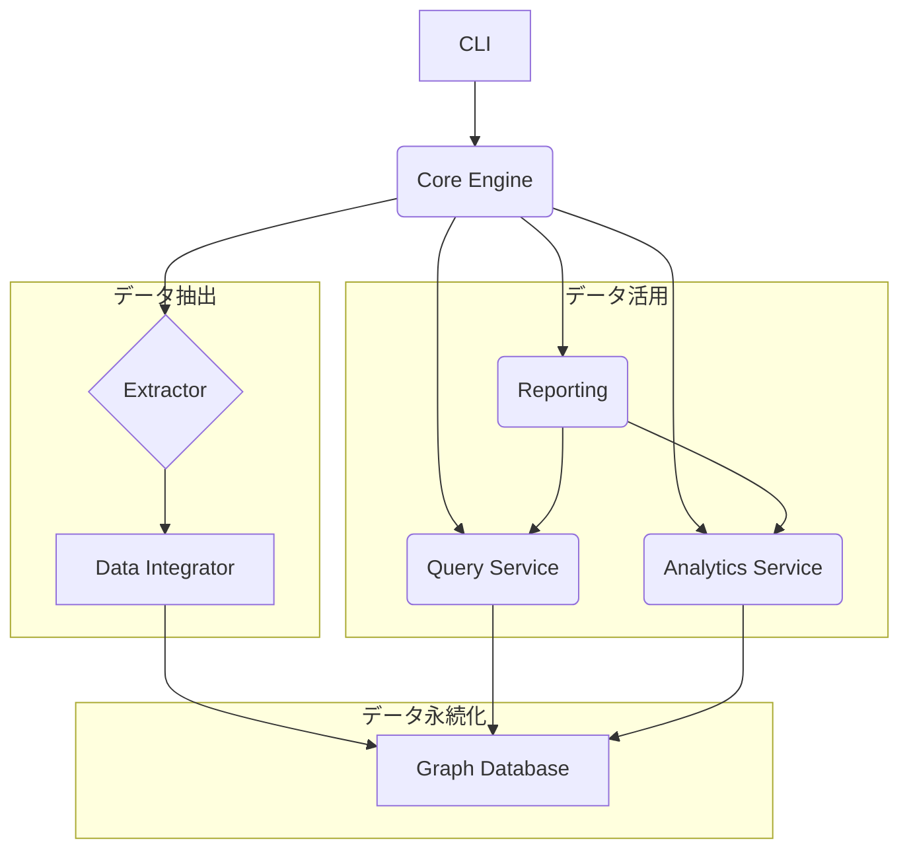

# PyDepGraph アーキテクチャ

## 概要

PyDepGraphは、Pythonプロジェクトのソースコードを静的解析し、その依存関係を抽出し、グラフデータベースに格納して分析するためのツールです。アーキテクチャは、拡張性、正確性、パフォーマンスを重視して設計されています。

## 主要コンポーネント

PyDepGraphは、以下の主要コンポーネントで構成されています。

1.  **CLI (`cli.py`)**:
    *   ユーザーからのコマンドを受け付けるエントリーポイントです。
    *   `argparse`を使用して、`analyze`, `query`, `analytics`, `report`などのサブコマンドを処理します。
    *   コマンドに応じて、`PyDepGraphCore`や各サービスを呼び出します。

2.  **Core Engine (`core.py`)**:
    *   分析プロセスの中心的なオーケストレーターです。
    *   設定を読み込み、指定されたExtractorを実行し、`DataIntegrator`を呼び出して結果を統合し、最終的に`GraphDatabase`に保存します。

3.  **Extractor (`extractors/`)**:
    *   ソースコードから依存関係情報を抽出する責務を負います。
    *   `ExtractorBase`という抽象基底クラスを継承して実装されます。
    *   現在、以下の2つのExtractorが存在します。
        *   **TachExtractor (`tach_extractor.py`)**: `tach`ツールを利用して、モジュールレベルの依存関係を高速に抽出します。
        *   **Code2FlowExtractor (`code2flow_extractor.py`)**: `code2flow`ツールやAST（抽象構文木）解析を利用して、関数、クラス、およびそれらの間の呼び出し・継承関係を抽出します。`code2flow`の実行に失敗した場合は、AST解析にフォールバックします。

4.  **Data Integrator (`services/data_integrator.py`)**:
    *   複数のExtractorから得られた抽出結果（`RawExtractionResult`）を統合し、重複を除去します。
    *   統合されたデータを、`models.py`で定義された統一データモデル（`ExtractionResult`）に変換します。

5.  **Graph Database (`database.py`)**:
    *   依存関係データを永続化するためのコンポーネントです。
    *   グラフデータベースとして`Kùzu`を使用しています。
    *   ノード（Module, Function, Class）とエッジ（ModuleImports, FunctionCalls, Inheritance）のスキーマを定義し、データの挿入やクエリ実行を管理します。

6.  **Query Service (`services/query_service.py`)**:
    *   データベースに格納された依存関係データに対して、検索クエリを実行するためのサービスです。
    *   特定のモジュールや関数の検索、依存関係の追跡など、基本的な検索機能を提供します。

7.  **Analytics Service (`services/analytics_service.py`)**:
    *   グラフデータ全体に対する高度な分析機能を提供します。
    *   `networkx`ライブラリを利用して、循環依存の検出、重要度スコア（PageRank）の計算、依存関係の深さ分析などを行います。

8.  **Reporting (`reporting.py`, `cli.py`)**:
    *   分析結果を人間が読みやすい形式（Markdown, JSONなど）でレポートとして出力します。
    *   `Analytics Service`や`Query Service`から得られたデータを整形して出力します。

## データモデル (`models.py`)

アプリケーション全体で一貫したデータ構造を提供するために、`dataclasses`を用いて以下の主要なデータモデルを定義しています。

*   **Nodes**: `Module`, `Function`, `Class`
*   **Relationships**: `ModuleImport`, `FunctionCall`, `Inheritance`, `Contains`
*   **Result Container**: `ExtractionResult`

これらのモデルは、Extractorからの生データを`DataIntegrator`が整形した後の標準形式であり、データベースへの保存や各サービスでの利用に使われます。

## 設定管理 (`config.py`)

*   `pydepgraph.toml`ファイルによる設定管理をサポートします。
*   Extractorの有効/無効、データベースのパス、分析対象外のファイルパターンなどを設定できます。

## データフロー

1.  ユーザーが`pydepgraph analyze`コマンドを実行します。
2.  `CLI`が`PyDepGraphCore`を呼び出します。
3.  `Core`は有効化されている`Extractor`（Tach, Code2Flow）を並行して実行します。
4.  各`Extractor`はソースコードを解析し、`RawExtractionResult`を生成します。
5.  `DataIntegrator`が複数の`RawExtractionResult`を受け取り、重複を除去・統合して、単一の`ExtractionResult`（標準データモデル）を生成します。
6.  `Core`は統合された`ExtractionResult`を`GraphDatabase`に渡して、ノードとリレーションシップをデータベースに保存します。
7.  ユーザーが`query`や`analytics`コマンドを実行すると、各`Service`が`GraphDatabase`からデータを読み出して処理を行い、結果を返します。
